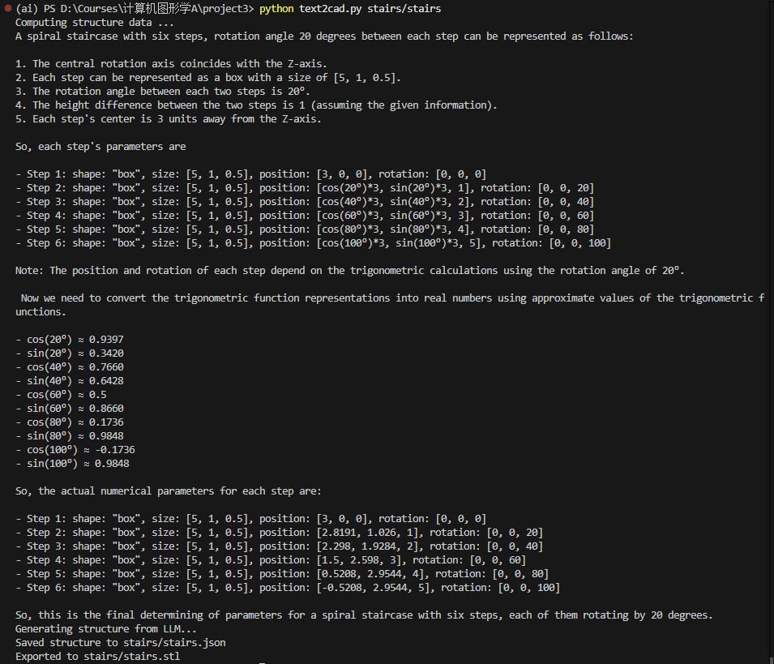
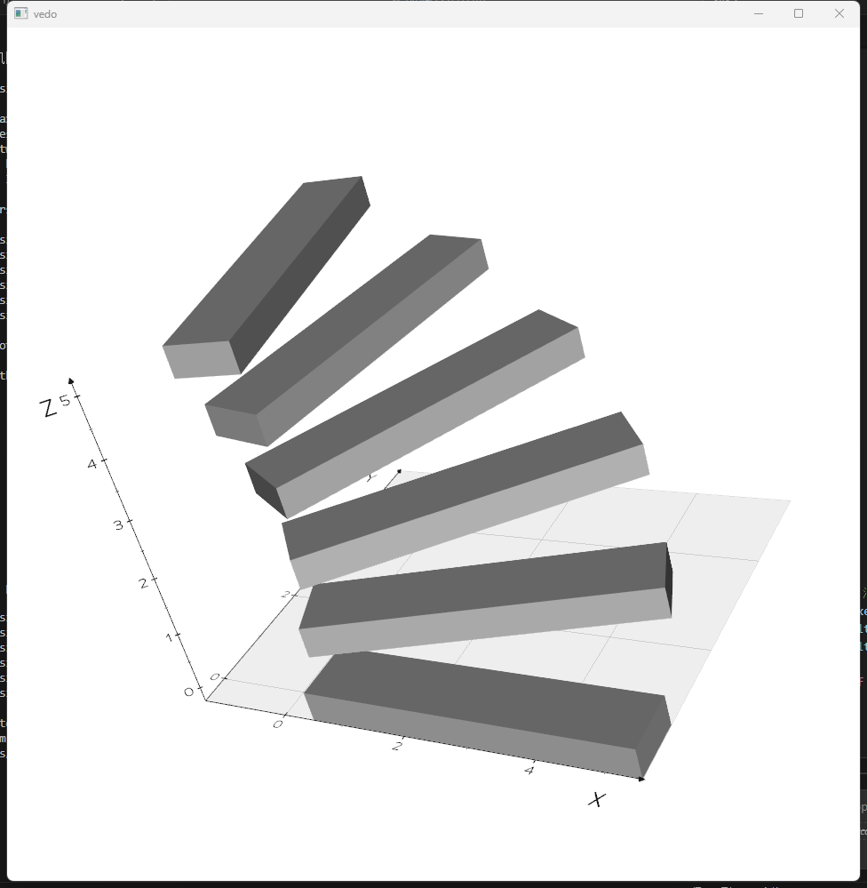
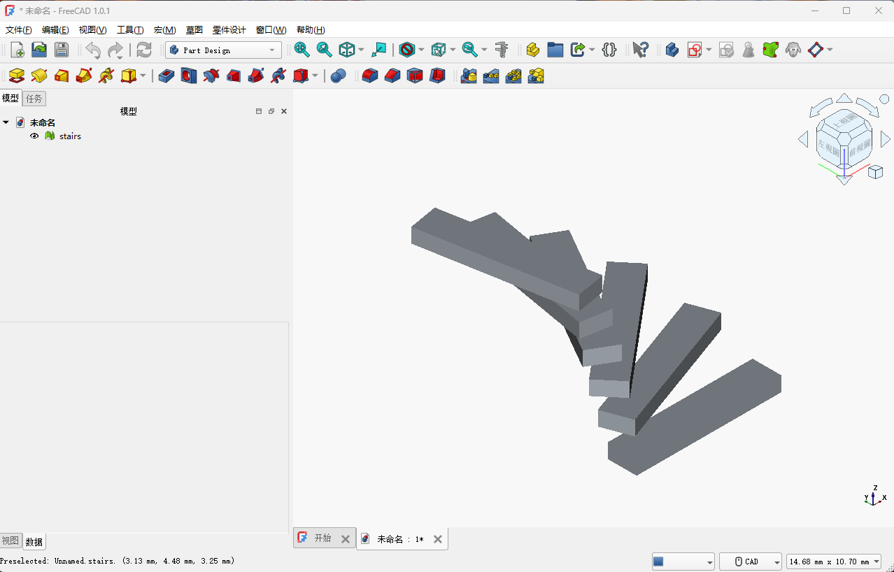

# Computer Graphics Project 3 Report

## Abstract

We referred to relevant papers in the Text2CAD field, attempted to call LLM, used contextual prompt learning methods, and compared the effects of prompts at different levels. We gradually converted the 3D structure described in natural language into a preset geometric representation, and provided real-time interactive visualization and saved it as STL files supported by CAD software.

## Introduction

Text2CAD is an AI framework for generating parametric CAD models from textual descriptions. This framework is designed for designers of all skill levels, enabling the generation of continuous CAD models through natural language instructions. Text2CAD addresses the challenges of modern software in prototype design, where creating complex CAD models is time-consuming, and intelligent systems for quickly generating simpler intermediate components are lacking.

### Technical Details and Implementation Methods

Text2CAD leverages an end-to-end transformer-based autoregressive network to generate parametric CAD models from textual inputs. The framework employs a data annotation pipeline to generate textual prompts based on natural language instructions, constructing the DeepCAD dataset. This dataset contains approximately 170,000 models and 660,000 textual annotations, covering a wide range of instructions from abstract CAD descriptions to detailed specifications.

### Applications and Future Prospects

Text2CAD demonstrates significant potential in AI-assisted design applications, improving design efficiency and accuracy. By reducing manual operations and simplifying the design process, this framework is expected to play a crucial role in industrial design and product development.

## Related Work

Recent advancements in AI-assisted design have focused on leveraging natural language processing (NLP) and computer-aided design (CAD) systems to bridge the gap between textual descriptions and parametric modeling. Works such as ShapeCoder and DeepCAD have explored the use of transformer-based architectures for generating CAD models. However, these systems often lack the ability to handle ambiguous or incomplete textual descriptions effectively. Text2CAD builds upon these foundations by introducing a robust pipeline for contextual prompt learning and structured JSON generation, ensuring compatibility with real-time visualization and CAD software.

## Methods

### L0-L3 Prompt

| Level | Discription        | Example                                                                                                                                           |
| ----- | ------------------ | ------------------------------------------------------------------------------------------------------------------------------------------------- |
| L0    | Abstract shape     | "A circular object with a hollow structure"                                                                                                       |
| L1    | Beginner level     | "Draw two concentric circles on the XY plane and stretch them to form a ring"                                                                     |
| L2    | Intermediate level | "Draw two circles with a center point of (0,0), radii of 5 and 10, and a stretching height of 10"                                                 |
| L3    | Expert level       | "Draw a circle with a center of (0.18, 0.18) and a radius of 0.0754 on the coordinate system (0,0,0), and stretch it 0.75 units along the Z-axis" |

### Design

$\text{Natural language description of 3D structure} \xrightarrow{\text{LLM analysis calculation}} \text{A natural language description with calculated data information such as shape and position (which may be incomplete or inaccurate)} \xrightarrow{\text{LLM analysis conversion}} \text{A JSON file that specifies the content} \xrightarrow{\text{code processing}} \text{Real time visualization display and saving to STL file}$

### Contextual Prompt Learning

In the first step, Text2CAD employs contextual prompt learning to calculate feasible numerical parameters for the described 3D structure. Examples are provided to guide the model in step-by-step reasoning and computation.

```python
EXAMPLES = [
    {
        "problem": "a 1 * 1 lego brick",
        "solution": "a 1 * 1 lego brick consists of two parts: 1. a shape box has a size of [1, 1, 0.3] (width, depth, height) and is positioned at the origin [0, 0, 0]; 2. a shape cylinder has a radius of 0.2 and height of 0.3, positioned at [0, 0, 0.3].",
    },
    {
        "problem": "A spiral staircase with three steps, slightly rotating around the central axis between each two steps, and the height difference between the two steps is consistent",
        "solution": """A spiral staircase with three steps can be represented as follows: 
            1. The central rotation axis coincides with the Z-axis.
            2. Each step can be represented as a box with a size of [5, 1, 0.5].
            3. The rotation angle between each two steps is 30°.
            4. The height difference between the two steps is 1.
            5. Each step's center is 3 units away from the Z-axis, 
                so the first step's x = 3, y = 0, z = 0,
                the second step's x = 3 * cos(30°), y = 3 * sin(30°), z = 1,
                the third step's x = 3 * cos(60°), y = 3 * sin(60°), z = 2.
        so we can create three boxes with the following parameters:
            - Step 1: shape: "box", size: [5, 1, 0.5], position: [3, 0, 0], rotation: [0, 0, 0]
            - Step 2: shape: "box", size: [5, 1, 0.5], position: [2.6, 1.5, 1], rotation: [0, 0, 30]
            - Step 3: shape: "box", size: [5, 1, 0.5], position: [1.5, 2.6, 2], rotation: [0, 0, 60]
        """,
    },
]
```

### Prompt Engineering

- Step 1: Numerical Parameter Calculation

The following prompt is used to calculate numerical parameters for the described 3D structure:

```python
SYSTEM_MESSAGE = """
    You are a mathematical assistant. 

    Given a natural language description of a 3D structure(maybe ambiguous), your task is to calculate the necessary numerical parameters for the structure. 

    Please provide a detailed step-by-step solution to the problem, explain your approach step by step, and finally provide an answer.

    You need to ensure that all the data obtained from the final calculation are real numbers.

    If specific data is not provided in the required 3D structure, you need to choose a reasonable data for calculation, and cannot write unknown variables such as x, y, z into the final calculation result.

    Some representations of trigonometric functions must also be converted to real numbers.
    """
```

In this step, we let the model make a preliminary judgment on what geometry can be used to represent the 3D structure. During debugging, it was found that when specific parameters are not mentioned in the natural language description, the derivation process and calculations of the model may have unknowns, or the final result may retain equations. When the new natural language description is passed into the large model to generate JSON formats, the unknowns and equations may be used as values for certain attributes, which may result in encountering strings at the position of real numbers when reading data from the JSON file for visualization. Therefore, we directly add restrictions in the prompt of this first step, requiring that some data can be selected by oneself, and the calculation result must be a real number (including removing some trigonometric functions, etc.).

- Step 2: JSON Generation

Based on the numerical parameters obtained in the first step, the following prompt is used to generate a structured JSON object:

```python
system_prompt = """
    You are a CAD model generator assistant.

    Given a natural language description of a 3D structure(There is some data, but it may not be complete), your task is to return a JSON object that describes a list of geometric parts and their parameters. 

    If the input description is not within the following requirements, you need to strictly redesign the 3D structure data according to the following requirements.

    Each part must include:
    - `"shape"`: one of "box", "cylinder", "sphere", "cone", "torus", "ellipsoid"
    - `"position"`: [x, y, z] float values
    - `"rotation"`: [x_angle, y_angle, z_angle] float values in degrees (optional, default is [0, 0, 0])
    - (Optional) `"color"`: Hex color string (e.g. "#ff0000")
    - (Optional) `"opacity"`: A float value between 0.0 (completely transparent) and 1.0 (completely opaque)

    Shape-specific parameters:
    - For `"box"`: add `"size"` as [width, depth, height]
    - For `"cylinder"`: add `"radius"` and `"height"`
    - For `"sphere"`: add `"radius"`
    - For `"cone"`: add `"radius_top"`, `"radius_bottom"`, `"height"`
    - For `"torus"`: add `"radius"` and `"tube"` (donut shape)
    - For `"ellipsoid"`: add `"radius_x"`, `"radius_y"`, `"radius_z"` (semi-axes lengths along x, y, z)

    Please strictly return a JSON object following this format, **no extra text**, no explanation, only valid parsable JSON.

    Here is an example:

    ```json
    {
    "parts": [
        {
        "shape": "cylinder",
        "radius": 5,
        "height": 10,
        "position": [0, 0, 0],
        "rotation": [0, 0, 45],
        "color": "#ff0000",
        "opacity": 0.8
        },
        {
        "shape": "box",
        "size": [10, 5, 3],
        "position": [15, 0, 0],
        "rotation": [0, 0, 0],
        }
    ]
    }
    ```

    notice: you should not include the beginning ```json and ending ``` in the output, just return the JSON object directly.
    Now generate the JSON structure for the following description:
    """
```

In this prompt, we strictly specify the content that can be used. If the input description is not within the range, LLM needs to re select and calculate. And it is required that the content returned by LLM is strictly in JSON format, trying to avoid us using code to modify the returned content with formatting errors.

## Experimental Results

- Example 1: Spiral Staircase

Prompt:

```
A spiral staircase with six steps, rotation angle is 20 degrees.
```

LLM Numerical Parameter Calculation:



JSON Result:

```json
{
  "parts": [
    {
      "shape": "box",
      "size": [
        5,
        1,
        0.5
      ],
      "position": [
        3,
        0,
        0
      ],
      "rotation": [
        0,
        0,
        0
      ]
    },
    {
      "shape": "box",
      "size": [
        5,
        1,
        0.5
      ],
      "position": [
        2.8191,
        1.026,
        1
      ],
      "rotation": [
        0,
        0,
        20
      ]
    },
    {
      "shape": "box",
      "size": [
        5,
        1,
        0.5
      ],
      "position": [
        2.298,
        1.9284,
        2
      ],
      "rotation": [
        0,
        0,
        40
      ]
    },
    {
      "shape": "box",
      "size": [
        5,
        1,
        0.5
      ],
      "position": [
        1.5,
        2.598,
        3
      ],
      "rotation": [
        0,
        0,
        60
      ]
    },
    {
      "shape": "box",
      "size": [
        5,
        1,
        0.5
      ],
      "position": [
        0.5208,
        2.9544,
        4
      ],
      "rotation": [
        0,
        0,
        80
      ]
    },
    {
      "shape": "box",
      "size": [
        5,
        1,
        0.5
      ],
      "position": [
        -0.5208,
        2.9544,
        5
      ],
      "rotation": [
        0,
        0,
        100
      ]
    }
  ]
}
```

Visualization (Vedo):



STL File in CAD Software:


